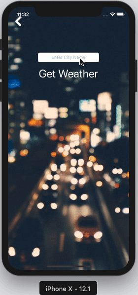

# Clima
An iOS application that forecasts the weather for your current location via OpenWeather API. https://openweathermap.org/api. 

Clima is a location-aware weather app. It will find out where you are in the world and query an open source weather service to retrieve the temperature and weather conditions. Also, you can change the city at the tap of a button. Want to know what it’s like in Rio? Clima is here to help.

## What I learned
* Use CocoaPods, AlamoFire SVProgressHUD and SwiftyJSON alongside OpenWeather API
* Parse JSON data and update UI with API data
* Find user location with CLLocationManager
* How to navigate between view controllers using segues

## Credits
 The London App Brewery

